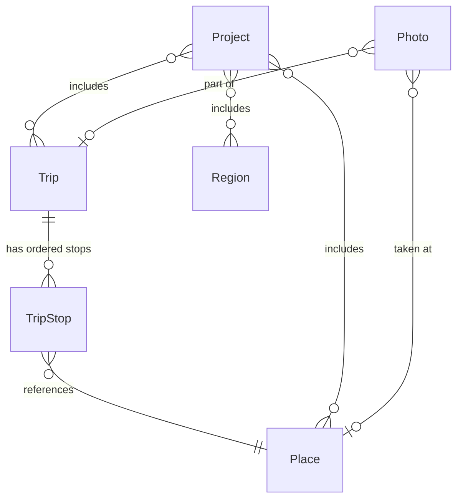

# Data Model

## Overview

Voyages stores travel data in a SQLite database with 6 entity types: Place, Trip, TripStop, Region, Project, and Photo. Entities are Python dataclasses defined in `src/voyages/domain/entities.py`. Value objects live in `src/voyages/domain/value_objects.py`.

## Entities

### Place

A geographic location that can appear on a map.

| Field | Type | Notes |
|-------|------|-------|
| `id` | UUID | Primary key |
| `name` | str | Display name |
| `latitude` | float | Decimal degrees |
| `longitude` | float | Decimal degrees |
| `source` | str | Free-form string. Common values: `"manual"`, `"exif"`, `"geocoded"`, `"cli"`, `"nominatim"` |
| `country` | str | Optional |
| `admin1` | str | State/province; optional |
| `category` | str | Optional |
| `notes` | str | Optional |
| `created_at` | datetime | Optional |
| `updated_at` | datetime | Optional |

### Trip

A named journey composed of ordered stops.

| Field | Type | Notes |
|-------|------|-------|
| `id` | UUID | Primary key |
| `name` | str | Display name |
| `description` | str | Optional |
| `start_date` | date | Optional |
| `end_date` | date | Optional |
| `stops` | list[TripStop] | Ordered list; default empty |

### TripStop

A single stop within a Trip, referencing a Place and recording arrival/departure times.

| Field | Type | Notes |
|-------|------|-------|
| `place_id` | UUID | References a Place |
| `position` | int | Ordering index (0-based) |
| `arrived_at` | datetime | Optional |
| `departed_at` | datetime | Optional |

### Region

An administrative or geographic area used for shading on maps.

| Field | Type | Notes |
|-------|------|-------|
| `id` | UUID | Primary key |
| `name` | str | Display name |
| `region_type` | str | `"country"`, `"state"`, etc. |
| `region_code` | str | ISO or FIPS code; optional |

### Project

A named map project that composes Places, Trips, and Regions for rendering.

| Field | Type | Notes |
|-------|------|-------|
| `id` | UUID | Primary key |
| `name` | str | Unique across projects |
| `map_type` | MapType | `travel`, `region`, or `route` (enum) |
| `description` | str | Optional |
| `config` | dict | Render configuration; default empty |
| `place_ids` | list[UUID] | Included places; default empty |
| `trip_ids` | list[UUID] | Included trips; default empty |
| `region_ids` | list[UUID] | Included regions; default empty |

### Photo

An image that can be linked to a Place and/or a Trip.

| Field | Type | Notes |
|-------|------|-------|
| `id` | UUID | Primary key |
| `file_path` | str | Path to the image file |
| `latitude` | float | EXIF latitude; optional |
| `longitude` | float | EXIF longitude; optional |
| `taken_at` | datetime | EXIF capture time; optional |
| `place_id` | UUID | Associated place; optional |
| `trip_id` | UUID | Associated trip; optional |

## Relationships

- A Trip has ordered TripStops; each TripStop references a Place.
- A Project composes Places, Trips, and Regions for map rendering.
- A Photo can be linked to a Place and/or a Trip.

## Value Objects

Value objects are immutable frozen dataclasses defined in `src/voyages/domain/value_objects.py`.

### Coordinates

Represents a geographic point. Validated on construction.

| Field | Type | Constraints |
|-------|------|-------------|
| `latitude` | float | -90 to 90 |
| `longitude` | float | -180 to 180 |

Validation is enforced in `__post_init__`; a `ValueError` is raised if either value is out of range.

### BoundingBox

Represents a rectangular geographic area defined by two corner coordinates.

| Field | Type | Notes |
|-------|------|-------|
| `southwest` | Coordinates | Lower-left corner |
| `northeast` | Coordinates | Upper-right corner |

`southwest.latitude` must be less than or equal to `northeast.latitude`, enforced in `__post_init__`.

**Method:** `contains(point: Coordinates) -> bool` — returns `True` if the point falls within the bounding box (inclusive boundaries).
