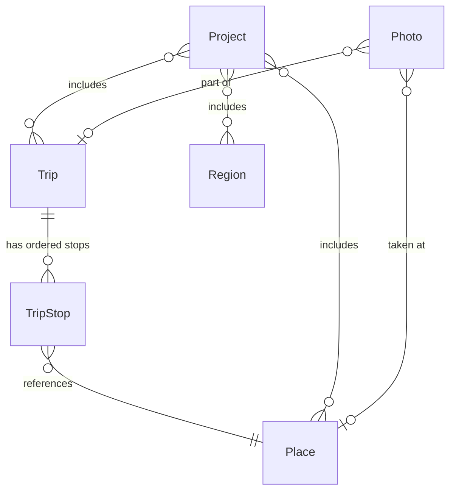

# Voyages Documentation Implementation Plan

> **For agentic workers:** REQUIRED SUB-SKILL: Use superpowers:subagent-driven-development (recommended) or superpowers:executing-plans to implement this plan task-by-task. Steps use checkbox (`- [ ]`) syntax for tracking.

**Goal:** Add comprehensive documentation (README, LICENSE, 16 doc files) to the Voyages repository so that users can install and use the tool, contributors can understand the architecture and submit PRs, and all docs are Astro-ready with frontmatter.

**Architecture:** Plain Markdown files with YAML frontmatter in `docs/` organized by section (getting-started, guides, reference, development). README serves as navigation hub. No docs tooling — GitHub-readable now, Astro-ready later.

**Tech Stack:** Markdown, Mermaid diagrams (GitHub-rendered), YAML frontmatter

**Spec:** `docs/superpowers/specs/2026-04-07-voyages-documentation-design.md`

---

**Parallelism note:** Tasks 1-3 are sequential. Tasks 4-10 are independent and can run in parallel once Task 3 is committed.

**Important context for all tasks:**
- The CLI entry point is `voyages` (defined in pyproject.toml as `voyages.cli:app`)
- The server default port is `8080` (not 8000) per the serve command
- `pyproject.toml` currently says MIT — Task 2 changes it to AGPL-3.0-or-later
- All frontmatter must follow this schema:
  ```yaml
  ---
  title: "Title"
  description: "One-line summary"
  section: "getting-started|guides|reference|development"
  order: N
  ---
  ```

---

### Task 1: Create branch and directory structure

**Files:**
- Create: `docs/getting-started/.gitkeep` (removed after first real file)
- Create: `docs/guides/.gitkeep`
- Create: `docs/reference/.gitkeep`
- Create: `docs/development/.gitkeep`

- [ ] **Step 1: Create feature branch**

```bash
git worktree add .claude/worktrees/docs-comprehensive -b docs/comprehensive-documentation
```

- [ ] **Step 2: Create doc directory structure**

```bash
cd .claude/worktrees/docs-comprehensive
mkdir -p docs/getting-started docs/guides docs/reference docs/development
touch docs/getting-started/.gitkeep docs/guides/.gitkeep docs/reference/.gitkeep docs/development/.gitkeep
```

- [ ] **Step 3: Commit**

```bash
git add docs/getting-started/.gitkeep docs/guides/.gitkeep docs/reference/.gitkeep docs/development/.gitkeep
git commit -m "docs: add documentation directory structure"
```

---

### Task 2: Add LICENSE and update pyproject.toml

**Files:**
- Create: `LICENSE`
- Modify: `pyproject.toml` (line with `license = "MIT"`)

- [ ] **Step 1: Create AGPL-3.0 LICENSE file**

Download the standard AGPL-3.0 license text and write it to `LICENSE` in the repository root. The file must begin with:

```
                    GNU AFFERO GENERAL PUBLIC LICENSE
                       Version 3, 19 November 2007

 Copyright (C) 2007 Free Software Foundation, Inc. <https://fsf.org/>
```

Use the full, unmodified AGPL-3.0 text from https://www.gnu.org/licenses/agpl-3.0.txt.

- [ ] **Step 2: Update pyproject.toml license field**

In `pyproject.toml`, change:
```toml
license = "MIT"
```
to:
```toml
license = "AGPL-3.0-or-later"
```

- [ ] **Step 3: Verify**

```bash
head -1 LICENSE
grep 'license' pyproject.toml
```

Expected: LICENSE starts with AGPL header, pyproject.toml shows `AGPL-3.0-or-later`.

- [ ] **Step 4: Commit**

```bash
git add LICENSE pyproject.toml
git commit -m "docs: add AGPL-3.0 license and update pyproject.toml"
```

---

### Task 3: Write README.md

**Files:**
- Create: `README.md`

This is the most critical file — it's the project's front door on GitHub.

- [ ] **Step 1: Write README.md**

Create `README.md` with the following content (adapt wording but preserve structure and accuracy):

```markdown
# Voyages

A Python map generation toolbox for travel cartography.

[](LICENSE)
[](https://www.python.org/downloads/)

Voyages combines a CLI and an interactive web UI to help you curate travel
data and render publication-quality cartographic maps. Import geotagged photos,
organize trips, choose from multiple styles and projections, and export to
SVG, PDF, PNG, WebP, or EPS.

## Features

- **Map rendering** — Generate travel, region, and route maps with Cartopy and Matplotlib
- **Multiple output formats** — SVG, PDF, PNG, WebP, EPS for print and web
- **Interactive web UI** — Svelte-based SPA with Leaflet map preview
- **Photo import** — Extract GPS coordinates and timestamps from EXIF data
- **Geocoding** — Search and reverse-geocode places via Nominatim (OpenStreetMap)
- **Built-in styles** — Default, vintage, minimal, and dark map themes with custom YAML support
- **Multiple projections** — EqualEarth for world views, PlateCarree for regional detail
- **Clean architecture** — Domain-driven design with protocol-based interfaces

## Quick Start

### Prerequisites

- Python 3.12+
- [uv](https://docs.astral.sh/uv/) (Python package manager)
- Node.js 18+ (for building the web UI)
- System libraries for Cartopy: GEOS and PROJ

macOS:
\`\`\`bash
brew install geos proj
\`\`\`

Ubuntu/Debian:
\`\`\`bash
sudo apt install libgeos-dev libproj-dev
\`\`\`

### Install

\`\`\`bash
git clone https://github.com/dalbrecht/Voyages.git
cd Voyages
make repo-setup    # Initialize git submodules
make bootstrap     # Create venv and install dependencies
make build-web     # Build the Svelte frontend
\`\`\`

### CLI

\`\`\`bash
voyages place add --name "Paris" --lat 48.8566 --lon 2.3522
voyages trip create "Europe 2025"
voyages project create "My Map" --map-type travel
voyages render "My Map" --style vintage --format png
\`\`\`

### Web UI

\`\`\`bash
voyages serve
\`\`\`

Open [http://127.0.0.1:8080](http://127.0.0.1:8080) in your browser to access
the dashboard, manage places and trips, and compose maps interactively.

## Screenshots

_Sample map outputs will be added here._

## Documentation

| Section | Description |
|---------|-------------|
| [Installation](docs/getting-started/installation.md) | Prerequisites, platform-specific setup, install from source |
| [Quick Start](docs/getting-started/quickstart.md) | First map in 5 minutes — CLI and web tracks |
| [Configuration](docs/getting-started/configuration.md) | Database, styles, server settings |
| [CLI Workflow](docs/guides/cli-workflow.md) | End-to-end tutorial using the command line |
| [Web Workflow](docs/guides/web-workflow.md) | End-to-end tutorial using the browser UI |
| [Importing Photos](docs/guides/importing-photos.md) | EXIF extraction, geocoding, linking to trips |
| [Map Styles](docs/guides/map-styles.md) | Built-in themes and custom YAML styles |
| [Rendering & Output](docs/guides/rendering-output.md) | Formats, projections, print settings |
| [CLI Reference](docs/reference/cli-commands.md) | All commands, flags, and options |
| [API Overview](docs/reference/api-overview.md) | REST API conventions and interactive docs |
| [API Endpoints](docs/reference/api-endpoints.md) | Endpoint examples with request/response bodies |
| [Data Model](docs/reference/data-model.md) | Entities, relationships, ER diagram |
| [Map Types](docs/reference/map-types.md) | Travel, region, and route map presets |
| [Contributing](docs/development/contributing.md) | Dev setup, branch workflow, code quality |
| [Architecture](docs/development/architecture.md) | Clean architecture layers and design decisions |
| [Testing](docs/development/testing.md) | Test strategy, coverage targets, conventions |

## Tech Stack

| Component | Technology |
|-----------|------------|
| Language | Python 3.12+ |
| CLI | [Typer](https://typer.tiangolo.com/) |
| API Server | [FastAPI](https://fastapi.tiangolo.com/) |
| Database | SQLite via [SQLAlchemy](https://www.sqlalchemy.org/) |
| Map Rendering | [Cartopy](https://scitools.org.uk/cartopy/) + [Matplotlib](https://matplotlib.org/) |
| Geocoding | [Nominatim](https://nominatim.org/) (OpenStreetMap) |
| Frontend | [Svelte 5](https://svelte.dev/) + [Vite](https://vite.dev/) |
| Map Preview | [Leaflet](https://leafletjs.com/) |
| Package Manager | [uv](https://docs.astral.sh/uv/) |
| Linting & Formatting | [Ruff](https://docs.astral.sh/ruff/) |
| Type Checking | [mypy](https://mypy-lang.org/) (strict mode) |

## Development

\`\`\`bash
make bootstrap     # Set up virtualenv and install all deps
make dev           # Install in editable mode with dev extras
make test          # Run tests
make lint          # Ruff check + mypy
make fmt           # Format code
make ci            # Full CI pipeline (lint + format check + test)
\`\`\`

See [Contributing](docs/development/contributing.md) for the full development guide.

## License

Voyages is licensed under the [GNU Affero General Public License v3.0](LICENSE).
You are free to use, modify, and distribute this software under the terms of the
AGPL-3.0. If you run a modified version on a server, you must make the source
code available to users of that server.
```

- [ ] **Step 2: Verify links reference valid paths**

```bash
# Check that all linked doc paths will exist (matches our planned file layout)
grep -oP '\(docs/[^)]+\)' README.md | tr -d '()' | sort
```

Expected: 16 doc paths matching the spec's file layout.

- [ ] **Step 3: Commit**

```bash
git add README.md
git commit -m "docs: add project README with quick start and documentation index"
```

---

### Task 4: Getting Started — installation.md, quickstart.md, configuration.md

**Files:**
- Create: `docs/getting-started/installation.md`
- Create: `docs/getting-started/quickstart.md`
- Create: `docs/getting-started/configuration.md`
- Remove: `docs/getting-started/.gitkeep`

**Key facts the docs must reference accurately:**
- Python >=3.12 (from pyproject.toml)
- uv for package management
- Node.js 18+ for `make build-web` (runs `cd web && npm ci && npm run build`)
- System deps: GEOS, PROJ for Cartopy
- `make repo-setup` initializes submodules (`git submodule update --init`)
- `make bootstrap` runs `uv venv && uv pip install -e ".[dev]"`
- `make build-web` runs `cd web && npm ci && npm run build`
- `make serve` runs `uv run uvicorn voyages.server:create_app --factory --reload`
- CLI verify: `voyages --help`
- Default serve address: `127.0.0.1:8080`
- Default database: `sqlite:///voyages.db` (created in working directory)

- [ ] **Step 1: Write installation.md**

Frontmatter: title "Installation", section "getting-started", order 1.

Sections:
1. **Prerequisites** — Python 3.12+, uv, Node.js 18+, GEOS/PROJ
2. **System Dependencies** — macOS (`brew install geos proj`), Ubuntu/Debian (`sudo apt install libgeos-dev libproj-dev`), note about other platforms checking Cartopy docs
3. **Install from Source** — git clone, `make repo-setup`, `make bootstrap`, `make build-web`
4. **Verify Installation** — `voyages --help` (show expected output: the Typer help with place/trip/project/import/serve/render subcommands), `make serve` then open browser
5. **What's Next** — Link to quickstart.md

- [ ] **Step 2: Write quickstart.md**

Frontmatter: title "Quick Start", section "getting-started", order 2.

Two parallel tracks with headers:

**CLI Track:**
1. `voyages place add --name "Paris" --lat 48.8566 --lon 2.3522`
2. `voyages place add --name "Rome" --lat 41.9028 --lon 12.4964`
3. `voyages trip create "Europe 2025"`
4. `voyages project create "My First Map" --map-type travel`
5. `voyages render "My First Map" --style vintage --format png --output .`
6. View the output: `open "My First Map.png"` (macOS) or `xdg-open` (Linux)

**Web Track:**
1. `voyages serve` → open `http://127.0.0.1:8080`
2. Navigate to Places → search "Paris" via Nominatim → add it
3. Navigate to Trips → create "Europe 2025"
4. Navigate to Map Composer → create project, select map type, pick style
5. Click Render → download the result

End with "Next Steps" linking to full workflow guides.

- [ ] **Step 3: Write configuration.md**

Frontmatter: title "Configuration", section "getting-started", order 3.

Sections:
1. **Database** — Default SQLite at `voyages.db` in working directory. Passed via `database_url` parameter to `create_app()`. For CLI, database is created in the current working directory.
2. **Map Styles** — Built-in styles in `styles/` directory (default, vintage, minimal, dark). Custom styles: any YAML file path passed to `--style`.
3. **Server** — `voyages serve --host 127.0.0.1 --port 8080`. Flags: `--host` (default "127.0.0.1"), `--port` (default 8080).
4. **Render Defaults** — `--dpi 200`, `--width 1200`, `--format png`, `--style default`, `--output .`

- [ ] **Step 4: Remove .gitkeep and commit**

```bash
rm docs/getting-started/.gitkeep
git add docs/getting-started/
git commit -m "docs: add getting started guides (installation, quickstart, configuration)"
```

---

### Task 5: Guides — cli-workflow.md and web-workflow.md

**Files:**
- Create: `docs/guides/cli-workflow.md`
- Create: `docs/guides/web-workflow.md`

**Key CLI commands (verified from source):**
- `voyages import photos <path>` — options: `--trip`, `--dry-run`
- `voyages place list` — no options
- `voyages place add` — `--name`, `--lat`, `--lon`, `--category`
- `voyages place search <query>` — searches via geocoding service
- `voyages trip list` — no options
- `voyages trip create <name>` — `--description`
- `voyages project list` — no options
- `voyages project create <name>` — `--map-type` (travel|region|route), `--description`
- `voyages project show <name>` — shows project details
- `voyages render <project_name>` — `--format` (svg|pdf|png|eps), `--style`, `--dpi`, `--width`, `--output`
- `voyages serve` — `--host`, `--port`

- [ ] **Step 1: Write cli-workflow.md**

Frontmatter: title "CLI Workflow", section "guides", order 1.

End-to-end walkthrough sections:
1. **Import Photos** — `voyages import photos ~/Photos/europe-2025 --trip "Europe 2025" --dry-run` first to preview, then without `--dry-run` to import. Explain EXIF GPS extraction.
2. **Review Places** — `voyages place list` to see extracted places.
3. **Add Places Manually** — `voyages place add --name "Eiffel Tower" --lat 48.8584 --lon 2.2945 --category landmark` for places without photos.
4. **Search and Add** — `voyages place search "Colosseum"` to find via Nominatim.
5. **Create a Trip** — `voyages trip create "Italy 2025" --description "Two weeks in Italy"`.
6. **Create a Project** — `voyages project create "Italy Map" --map-type route`.
7. **Render** — `voyages render "Italy Map" --style vintage --format svg --dpi 300 --output ./maps`.
8. **Try Different Outputs** — Re-render with `--format pdf` for print, `--style dark` for different look.

Each step: command, brief explanation of flags, description of expected output.

- [ ] **Step 2: Write web-workflow.md**

Frontmatter: title "Web UI Workflow", section "guides", order 2.

Walkthrough sections:
1. **Start the Server** — `voyages serve` or `make serve` (for hot-reload during development). Open `http://127.0.0.1:8080`.
2. **Dashboard** — Overview of the interface: quick-action buttons, navigation tabs.
3. **Add Places** — Navigate to Places tab. Use the Nominatim search bar to find places. Click to add. Manual add with coordinates also available.
4. **Manage Trips** — Navigate to Trips tab. Create a trip, add description. (Note: trip stop management is done through the API or CLI currently.)
5. **Compose a Map** — Navigate to Map Composer. Create a project: name, map type (travel/region/route). Select style.
6. **Preview and Render** — Map preview shows places on a Leaflet map. Click Render to generate the map. Download the result.

Note screenshot placeholders: "Screenshot: [description of what would be shown]".

- [ ] **Step 3: Remove .gitkeep if present, commit**

```bash
rm -f docs/guides/.gitkeep
git add docs/guides/cli-workflow.md docs/guides/web-workflow.md
git commit -m "docs: add CLI and web UI workflow guides"
```

---

### Task 6: Guides — importing-photos.md, map-styles.md, rendering-output.md

**Files:**
- Create: `docs/guides/importing-photos.md`
- Create: `docs/guides/map-styles.md`
- Create: `docs/guides/rendering-output.md`

**Key facts from source:**
- Photo entity fields: `id`, `file_path`, `latitude`, `longitude`, `taken_at`, `place_id`, `trip_id`
- Import command: `voyages import photos <path>` with `--trip` and `--dry-run`
- Style dataclass fields: `name`, `ocean`, `land`, `visited`, `visited_light`, `route`, `font`, `borders`, `marker`, `marker_size`, `title_size`, `label_size`
- Built-in styles: default, vintage, minimal, dark (in `styles/` directory)
- Style loader: `load_style(name_or_path)` — accepts built-in name or file path
- Output formats enum: SVG, PDF, PNG, WEBP, EPS
- Projections: EqualEarth (travel maps), PlateCarree (region and route maps)
- Render config: `dpi` (200), `width` (1200), `center_lat`, `center_lon`, `extent` (degrees)

- [ ] **Step 1: Write importing-photos.md**

Frontmatter: title "Importing Photos", section "guides", order 3.

Sections:
1. **Overview** — Voyages extracts GPS coordinates and timestamps from photo EXIF data to automatically create places.
2. **Supported Data** — GPS coordinates (latitude/longitude), timestamp (`taken_at`). Photos without GPS data are skipped with a warning.
3. **Basic Import** — `voyages import photos ~/Photos/trip-2025`. Explain what happens: scans directory, reads EXIF, creates Place entries with source="exif".
4. **Dry Run** — `voyages import photos ~/Photos/trip-2025 --dry-run` to preview without writing to database.
5. **Link to a Trip** — `voyages import photos ~/Photos/trip-2025 --trip "Europe 2025"` to associate photos with an existing trip.
6. **What Gets Created** — Each geotagged photo produces a Place (lat/lon from GPS) and a Photo record (file path, timestamps, place link).
7. **Common Issues** — No GPS data (phone camera with location off), timezone handling, duplicate photos.

- [ ] **Step 2: Write map-styles.md**

Frontmatter: title "Map Styles", section "guides", order 4.

Sections:
1. **Built-in Styles** — Table of 4 styles with descriptions:
   - `default` — Muted earth tones, clean borders, red markers
   - `vintage` — Warm, aged paper aesthetic
   - `minimal` — Minimal chrome, light palette
   - `dark` — Dark background, light features
2. **Using a Style** — CLI: `--style vintage`. Web: select from dropdown in Map Composer.
3. **Style File Anatomy** — Show the full `default.yml` content with annotations explaining each field:
   ```yaml
   name: default
   ocean: "#ACBEBE"        # Ocean/water fill color
   land: "#F4F4EF"         # Land mass fill color
   visited: "#A01D26"      # Visited region highlight
   visited_light: "#D4737A" # Lighter visited variant
   route: "#2C5F7C"        # Route line color
   font: "DejaVu Sans"     # Font family for labels
   borders: "#CCCCCC"      # Country/region border color
   marker: "#A01D26"       # Place marker color
   marker_size: 4          # Marker radius in points
   title_size: 16          # Title font size
   label_size: 8           # Label font size
   ```
4. **Creating a Custom Style** — Copy a built-in style from `styles/`, modify values, save as new YAML. Reference by file path: `--style ./my-styles/ocean-blue.yml`.

- [ ] **Step 3: Write rendering-output.md**

Frontmatter: title "Rendering & Output", section "guides", order 5.

Sections:
1. **Output Formats** — Table:
   | Format | Flag | Best For |
   |--------|------|----------|
   | PNG | `--format png` | Web, social media, quick preview |
   | SVG | `--format svg` | Scalable graphics, editing in Illustrator/Inkscape |
   | PDF | `--format pdf` | Print-ready documents |
   | EPS | `--format eps` | Legacy print workflows |
   Note: WebP is supported as an OutputFormat enum but the render command currently accepts svg|pdf|png|eps.
2. **Projections** — EqualEarth (used for travel maps — world view, equal-area), PlateCarree (used for region and route maps — zoomed, equirectangular).
3. **Render Settings** — `--dpi` (default 200, use 300 for print), `--width` (default 1200 pixels), `--output` (directory for output file, default `.`).
4. **Map Types and Rendering** — Brief overview of how each map type renders differently:
   - Travel: shaded visited regions, place markers, EqualEarth projection
   - Region: zoomed to region bounds, detailed boundaries, labels, scale
   - Route: trip path as polyline, ordered stop markers, auto-fit extent
5. **Examples** — Show 3-4 render commands for common scenarios (web preview, print PDF, high-res poster).

- [ ] **Step 4: Commit**

```bash
git add docs/guides/importing-photos.md docs/guides/map-styles.md docs/guides/rendering-output.md
git commit -m "docs: add photo import, map styles, and rendering guides"
```

---

### Task 7: Reference — cli-commands.md

**Files:**
- Create: `docs/reference/cli-commands.md`

This is the largest single reference doc. Must be accurate to the actual CLI source.

**Verified CLI structure from `src/voyages/cli/`:**

```
voyages
├── place
│   ├── list
│   ├── search <query>
│   └── add --name --lat --lon [--category]
├── trip
│   ├── list
│   └── create <name> [--description]
├── project
│   ├── list
│   ├── create <name> [--map-type] [--description]
│   └── show <name>
├── import
│   └── photos <path> [--trip] [--dry-run]
├── serve [--host] [--port]
└── render <project_name> [--format] [--style] [--dpi] [--width] [--output]
```

- [ ] **Step 1: Write cli-commands.md**

Frontmatter: title "CLI Reference", section "reference", order 1.

Structure: one `##` section per command group, one `###` per subcommand.

For each command document:
- **Synopsis** — `voyages <group> <command> [OPTIONS]`
- **Description** — What it does
- **Arguments** — Positional args with types
- **Options** — Table: flag, type, default, description
- **Example** — One realistic usage with expected output description

Command groups to document:
1. `voyages place list` — no args, no options
2. `voyages place search <query>` — query is positional string
3. `voyages place add` — options: `--name` (str, required), `--lat` (float, required), `--lon` (float, required), `--category` (str, optional)
4. `voyages trip list` — no args, no options
5. `voyages trip create <name>` — name is positional, `--description` (str, optional)
6. `voyages project list` — no args, no options
7. `voyages project create <name>` — name is positional, `--map-type` (str, default "travel", choices: travel|region|route), `--description` (str, optional)
8. `voyages project show <name>` — name is positional
9. `voyages import photos <path>` — path is positional, `--trip` (str, optional), `--dry-run` (bool flag)
10. `voyages serve` — `--host` (str, default "127.0.0.1"), `--port` (int, default 8080)
11. `voyages render <project_name>` — project_name is positional, `--format` (str, default "png", choices: svg|pdf|png|eps), `--style` (str, default "default"), `--dpi` (int, default 200), `--width` (int, default 1200), `--output` (str, default ".")

- [ ] **Step 2: Remove .gitkeep if present, commit**

```bash
rm -f docs/reference/.gitkeep
git add docs/reference/cli-commands.md
git commit -m "docs: add CLI command reference"
```

---

### Task 8: Reference — api-overview.md and api-endpoints.md

**Files:**
- Create: `docs/reference/api-overview.md`
- Create: `docs/reference/api-endpoints.md`

**Verified API routes from `src/voyages/server/routes/`:**

| Method | Path | Purpose |
|--------|------|---------|
| GET | `/api/places` | List places |
| POST | `/api/places` | Create place |
| GET | `/api/places/search?q=<query>` | Search places |
| DELETE | `/api/places/{place_id}` | Delete place |
| GET | `/api/trips` | List trips |
| POST | `/api/trips` | Create trip |
| DELETE | `/api/trips/{trip_id}` | Delete trip |
| GET | `/api/projects` | List projects |
| POST | `/api/projects` | Create project |
| DELETE | `/api/projects/{project_id}` | Delete project |
| GET | `/api/regions` | List regions |
| POST | `/api/regions` | Create region |
| DELETE | `/api/regions/{region_id}` | Delete region |
| POST | `/api/render/{project_id}` | Render project map |

**Request/response models (from server route files):**

PlaceCreate: `{name: str, lat: float, lon: float, source: str, country?: str, admin1?: str, category?: str, notes?: str}`
PlaceResponse: `{id: UUID, name: str, lat: float, lon: float, country?: str, admin1?: str, category?: str, notes?: str, source: str}`
TripCreate: `{name: str, description?: str}`
TripResponse: `{id: UUID, name: str, description?: str, start_date?: str, end_date?: str}`
ProjectCreate: `{name: str, map_type: str, description?: str}`
ProjectResponse: `{id: UUID, name: str, description?: str, map_type: str}`
RegionCreate: `{name: str, region_type: str, region_code?: str}`
RegionResponse: `{id: UUID, name: str, region_type: str, region_code?: str}`

- [ ] **Step 1: Write api-overview.md**

Frontmatter: title "API Overview", section "reference", order 2.

Sections:
1. **Base URL** — `http://127.0.0.1:8080/api` (when running `voyages serve` with defaults)
2. **Interactive Documentation** — Swagger UI at `/docs`, ReDoc at `/redoc`. Mention these are auto-generated by FastAPI.
3. **Content Type** — All requests and responses use `application/json`. Render endpoint returns a file.
4. **Identifiers** — All entities use UUID v4 identifiers.
5. **Authentication** — None. Voyages is a single-user local tool.
6. **Error Responses** — FastAPI standard format: `{"detail": "Error message"}` with appropriate HTTP status codes (404, 422, etc.).
7. **CORS** — All origins allowed (configured for local development).

- [ ] **Step 2: Write api-endpoints.md**

Frontmatter: title "API Endpoints", section "reference", order 3.

One section per resource group. Each section has 1-2 curl examples with full request and response bodies.

**Places section:**
```bash
# Create a place
curl -X POST http://127.0.0.1:8080/api/places \
  -H "Content-Type: application/json" \
  -d '{"name": "Paris", "lat": 48.8566, "lon": 2.3522, "source": "manual", "country": "France"}'

# Response (201)
{
  "id": "...",
  "name": "Paris",
  "lat": 48.8566,
  "lon": 2.3522,
  "country": "France",
  "admin1": null,
  "category": null,
  "notes": null,
  "source": "manual"
}

# Search places
curl "http://127.0.0.1:8080/api/places/search?q=paris"
```

**Trips section:**
```bash
# Create a trip
curl -X POST http://127.0.0.1:8080/api/trips \
  -H "Content-Type: application/json" \
  -d '{"name": "Europe 2025", "description": "Summer backpacking trip"}'
```

**Projects section:**
```bash
# Create a project
curl -X POST http://127.0.0.1:8080/api/projects \
  -H "Content-Type: application/json" \
  -d '{"name": "Europe Map", "map_type": "travel", "description": "Travel overview map"}'
```

**Regions section:**
```bash
# Create a region
curl -X POST http://127.0.0.1:8080/api/regions \
  -H "Content-Type: application/json" \
  -d '{"name": "France", "region_type": "country", "region_code": "FR"}'
```

**Render section:**
```bash
# Render a project (returns PNG file)
curl -X POST http://127.0.0.1:8080/api/render/{project_id} --output map.png
```

End with: "For the complete API specification including all parameters and response schemas, see the interactive docs at `/docs` when running the server."

- [ ] **Step 3: Commit**

```bash
git add docs/reference/api-overview.md docs/reference/api-endpoints.md
git commit -m "docs: add API overview and endpoint reference"
```

---

### Task 9: Reference — data-model.md and map-types.md

**Files:**
- Create: `docs/reference/data-model.md`
- Create: `docs/reference/map-types.md`

- [ ] **Step 1: Write data-model.md**

Frontmatter: title "Data Model", section "reference", order 4.

Sections:
1. **Overview** — Voyages stores travel data in a SQLite database with 6 entity types.
2. **Entities** — One subsection per entity:
   - **Place** — `id` (UUID), `name` (str), `latitude` (float), `longitude` (float), `source` (str: "manual", "exif", "geocoded"), `country` (str?), `admin1` (str?), `category` (str?), `notes` (str?), `created_at`, `updated_at`
   - **Trip** — `id` (UUID), `name` (str), `description` (str?), `start_date` (date?), `end_date` (date?), `stops` (list of TripStop)
   - **TripStop** — `place_id` (UUID), `position` (int, ordering), `arrived_at` (datetime?), `departed_at` (datetime?)
   - **Region** — `id` (UUID), `name` (str), `region_type` (str: "country", "state", etc.), `region_code` (str?)
   - **Project** — `id` (UUID), `name` (str, unique), `map_type` (travel|region|route), `description` (str?), `config` (dict), `place_ids` (list[UUID]), `trip_ids` (list[UUID]), `region_ids` (list[UUID])
   - **Photo** — `id` (UUID), `file_path` (str), `latitude` (float?), `longitude` (float?), `taken_at` (datetime?), `place_id` (UUID?), `trip_id` (UUID?)
3. **Relationships** — Plain-language description plus Mermaid ER diagram:

````markdown

````

4. **Value Objects** — Coordinates (lat/lon with validation: lat -90 to 90, lon -180 to 180), BoundingBox (southwest + northeast Coordinates with `contains()` method).

- [ ] **Step 2: Write map-types.md**

Frontmatter: title "Map Types", section "reference", order 5.

Sections:
1. **Overview** — Three map types, each optimized for different visualization goals. Set via `--map-type` on project creation.
2. **Travel Map** (`travel`) — World or large-area view. Shades visited regions, places as markers, legend. Uses EqualEarth projection (equal-area, good for world maps). Best for: showing all countries/places you've visited.
3. **Region Map** (`region`) — Zoomed view of a specific area. Detailed boundaries (admin_1 from Natural Earth), place markers, labels, scale bar. Uses PlateCarree projection. Best for: detailed view of a country or state.
4. **Route Map** (`route`) — Trip path visualization. Draws polylines between ordered stops, numbered stop markers, optional date labels. Uses PlateCarree with auto-fit extent. Best for: showing a specific trip's itinerary.
5. **Configuration** — Config dict options passed through `config` field on Project: `dpi`, `width`, `center_lat`, `center_lon`, `extent` (degrees). Defaults: dpi=200, width=1200, extent=20.
6. **Choosing a Map Type** — Decision guide: visited countries → travel, zoomed area → region, trip itinerary → route.

- [ ] **Step 3: Commit**

```bash
git add docs/reference/data-model.md docs/reference/map-types.md
git commit -m "docs: add data model and map types reference"
```

---

### Task 10: Development — contributing.md, architecture.md, testing.md

**Files:**
- Create: `docs/development/contributing.md`
- Create: `docs/development/architecture.md`
- Create: `docs/development/testing.md`
- Remove: `docs/development/.gitkeep`

**Key facts from source:**
- `make repo-setup` runs `git submodule update --init`
- `make bootstrap` runs `uv venv && uv pip install -e ".[dev]"`
- `make dev` runs `uv pip install -e ".[dev]"`
- `make ci` runs `lint && fmt-check && test`
- `make lint` runs `ruff check src tests && mypy src`
- `make fmt` runs `ruff format src tests`
- `make test` runs `uv run pytest`
- Ruff config: line-length 100, target py312
- Mypy: strict = true, pydantic plugin
- Pytest: testpaths = ["tests"], pythonpath = ["src"]
- Source layout: `src/voyages/{domain,application,infrastructure,cli,server}/`
- Test layout: `tests/{domain,application,infrastructure,cli,server}/`

- [ ] **Step 1: Write contributing.md**

Frontmatter: title "Contributing", section "development", order 1.

Sections:
1. **Getting Started** — Fork on GitHub, clone, `make repo-setup && make bootstrap && make dev`.
2. **Branch Workflow** — One branch per feature/fix. Branch from `main`. Naming: `feat/<name>`, `fix/<name>`, `docs/<name>`.
3. **Conventional Commits** — Format: `type(scope): subject`. Types: feat, fix, docs, refactor, test, chore. Examples.
4. **Code Quality** — Before submitting a PR, run `make ci`. This runs:
   - `make lint` — ruff check + mypy strict
   - `make fmt-check` — ruff format --check (line length 100, Python 3.12 target)
   - `make test` — pytest
5. **Pull Requests** — One PR per feature/fix. Describe changes. Reference issues. `make pr` creates a PR via gh CLI.
6. **Code Style** — Enforced by ruff. Line length 100. Strict mypy typing. No need to run formatters manually if you run `make fmt` before committing.
7. **Getting Oriented** — Link to architecture.md for codebase structure, testing.md for test conventions.

- [ ] **Step 2: Write architecture.md**

Frontmatter: title "Architecture", section "development", order 2.

Sections:
1. **Overview** — Clean architecture with 4 layers. Inner layers never import from outer layers.
2. **Layer Diagram** — Text or Mermaid diagram showing: Domain (innermost) → Application → Infrastructure → Entry Points (outermost).
3. **Domain Layer** (`src/voyages/domain/`) — Pure Python dataclasses (Place, Trip, TripStop, Region, Project, Photo), value objects (Coordinates, BoundingBox), enums (MapType, OutputFormat), domain exceptions. Zero external dependencies.
4. **Application Layer** (`src/voyages/application/`) — Service classes (PlaceService, TripService, ProjectService, RegionService, PhotoService). Protocol-based interfaces for repositories and external services. Depends only on domain.
5. **Infrastructure Layer** (`src/voyages/infrastructure/`) — Concrete implementations:
   - `db/` — SQLAlchemy ORM models and repository implementations (SQLite)
   - `renderer/` — Cartopy + Matplotlib rendering engine, style loader
   - `geocoding/` — Nominatim client via httpx
   - `exif/` — Photo metadata extraction via Pillow
6. **Entry Points** — CLI (`src/voyages/cli/`) via Typer, Server (`src/voyages/server/`) via FastAPI. Thin wrappers that create infrastructure instances and pass them to application services.
7. **Key Design Decisions** — Protocol-based interfaces (not ABC) for testability; SQLite as embedded default (no server required); layer-based rendering pipeline (base → shapes → data → styles → annotations).
8. **Directory Map** — Tree showing `src/voyages/` structure mapped to layers.

- [ ] **Step 3: Write testing.md**

Frontmatter: title "Testing", section "development", order 3.

Sections:
1. **Running Tests** — `make test` (runs `uv run pytest`). Single file: `pytest tests/domain/test_entities.py`. Verbose: `pytest -v`. With coverage: `pytest --cov=voyages`.
2. **Test Structure** — Mirrors source: `tests/domain/`, `tests/application/`, `tests/infrastructure/`, `tests/cli/`, `tests/server/`. Each test directory tests its corresponding source layer.
3. **Coverage Targets** — 100% for domain layer (pure logic, no excuses). 95%+ overall.
4. **Testing by Layer:**
   - Domain tests: Pure unit tests. No mocks, no I/O. Test dataclass behavior, validation, value objects.
   - Application tests: Test service logic. Mock repository protocols. Verify orchestration.
   - Infrastructure tests: Integration tests with real (in-memory) SQLite. Test ORM mappings, queries, renderer output.
   - CLI tests: Test command execution and output via Typer's test runner.
   - Server tests: Test endpoints via FastAPI's TestClient.
5. **Conventions** — Fixtures for database sessions and test data. Factories for creating domain entities with sensible defaults. Mock at layer boundaries only — don't mock within a layer.

- [ ] **Step 4: Remove .gitkeep and commit**

```bash
rm -f docs/development/.gitkeep
git add docs/development/
git commit -m "docs: add contributing, architecture, and testing guides"
```

---

### Task 11: Final cleanup and PR

**Files:**
- Remove: `docs/guides/.gitkeep` (if not already removed)
- Remove: `docs/reference/.gitkeep` (if not already removed)

- [ ] **Step 1: Verify all 16 doc files exist**

```bash
find docs/getting-started docs/guides docs/reference docs/development -name "*.md" | sort
```

Expected output (16 files):
```
docs/development/architecture.md
docs/development/contributing.md
docs/development/testing.md
docs/getting-started/configuration.md
docs/getting-started/installation.md
docs/getting-started/quickstart.md
docs/guides/cli-workflow.md
docs/guides/importing-photos.md
docs/guides/map-styles.md
docs/guides/rendering-output.md
docs/guides/web-workflow.md
docs/reference/api-endpoints.md
docs/reference/api-overview.md
docs/reference/cli-commands.md
docs/reference/data-model.md
docs/reference/map-types.md
```

- [ ] **Step 2: Verify all README doc links resolve**

```bash
grep -oP '\(docs/[^)]+\)' README.md | tr -d '()' | while read -r path; do
  if [ ! -f "$path" ]; then echo "BROKEN: $path"; fi
done
```

Expected: no output (all links valid).

- [ ] **Step 3: Verify all frontmatter is present**

```bash
for f in $(find docs/getting-started docs/guides docs/reference docs/development -name "*.md"); do
  if ! head -1 "$f" | grep -q '^---'; then
    echo "MISSING FRONTMATTER: $f"
  fi
done
```

Expected: no output (all files have frontmatter).

- [ ] **Step 4: Remove any remaining .gitkeep files**

```bash
find docs -name ".gitkeep" -delete
git add -A docs/
```

- [ ] **Step 5: Commit cleanup if needed**

```bash
git diff --cached --stat
# Only commit if there are staged changes
git commit -m "docs: remove .gitkeep files after adding documentation"
```

- [ ] **Step 6: Create PR**

```bash
git push -u origin docs/comprehensive-documentation
gh pr create \
  --title "docs: add comprehensive project documentation" \
  --body "$(cat <<'EOF'
## Summary

- Add AGPL-3.0 LICENSE and update pyproject.toml license field
- Add README.md with project overview, quick start, and documentation index
- Add 16 documentation files across 4 sections:
  - **Getting Started:** installation, quickstart, configuration
  - **Guides:** CLI workflow, web UI workflow, photo import, map styles, rendering
  - **Reference:** CLI commands, API overview, API endpoints, data model, map types
  - **Development:** contributing, architecture, testing
- All docs use Astro-compatible YAML frontmatter for future site migration

## Test plan

- [ ] Verify `README.md` renders correctly on GitHub
- [ ] Verify all doc links in README resolve to existing files
- [ ] Verify Mermaid diagram in data-model.md renders on GitHub
- [ ] Spot-check CLI commands and API examples against actual implementation
- [ ] Verify frontmatter is present and well-formed on all doc files

🤖 Generated with [Claude Code](https://claude.com/claude-code)
EOF
)"
```
