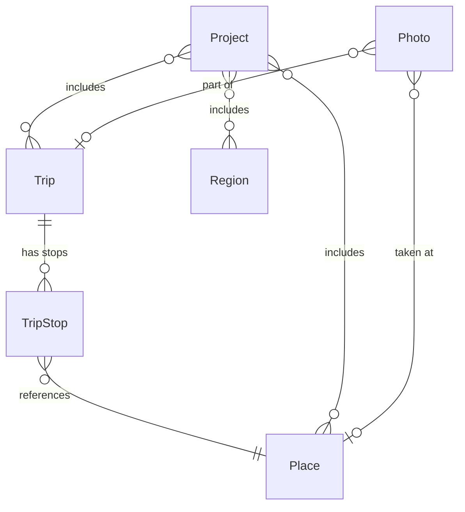

# Voyages Documentation Design Spec

**Date:** 2026-04-07
**Status:** Draft
**Audience:** End users, contributors, maintainers

## Overview

Comprehensive documentation for the Voyages map generation toolbox, covering installation, usage (CLI and web UI), API reference, and contributor guidance. All docs are plain Markdown with Astro-compatible frontmatter, readable on GitHub today and designed to slot into an Astro content collection when a marketing site is built.

## Goals

1. A new user can install Voyages and render their first map within 10 minutes
2. Both CLI and web UI are documented as equal, first-class interfaces
3. Contributors can understand the architecture, set up a dev environment, and submit a PR without asking questions
4. API consumers get hand-written examples plus a link to full Swagger/ReDoc specs
5. No extra tooling — no docs site generator, no build step for docs

## License

AGPL-3.0-or-later. A LICENSE file will be added to the repository root.

## File Layout

```
README.md
LICENSE
docs/
├── getting-started/
│   ├── installation.md
│   ├── quickstart.md
│   └── configuration.md
├── guides/
│   ├── cli-workflow.md
│   ├── web-workflow.md
│   ├── importing-photos.md
│   ├── map-styles.md
│   └── rendering-output.md
├── reference/
│   ├── cli-commands.md
│   ├── api-overview.md
│   ├── api-endpoints.md
│   ├── data-model.md
│   └── map-types.md
├── development/
│   ├── contributing.md
│   ├── architecture.md
│   └── testing.md
```

## Frontmatter Convention

Every Markdown file in `docs/` uses this frontmatter schema:

```yaml
---
title: "Human-readable title"
description: "One-line summary for SEO and Astro content collections"
section: "getting-started | guides | reference | development"
order: 1  # Sort position within section
---
```

This makes migration to Astro content collections trivial — each section becomes a collection, and frontmatter fields map directly to collection schema.

## README

The README serves as the project's front door and primary navigation hub.

**Sections in order:**

1. **Header** — Project name, one-line tagline, badges (AGPL-3.0, Python 3.12+, CI status placeholder)
2. **Description** — 2-3 sentences: what Voyages is, who it's for, what makes it distinct (personal travel cartography toolbox, CLI + web, publication-quality output)
3. **Feature highlights** — Bulleted list: map rendering (SVG/PDF/PNG/WebP/EPS), interactive web UI with Leaflet preview, photo import with EXIF GPS extraction, multiple projections and styles, clean architecture
4. **Quick start** — Minimal install + first render, showing both CLI and web paths side by side. Not a full tutorial — just enough to see a result in under 2 minutes of reading.
5. **Screenshots/examples** — Placeholder section for sample map output images. Initially contains a note that examples will be added; does not block the PR.
6. **Documentation** — Table linking to each `docs/` section with one-line descriptions
7. **Tech stack** — Compact table: Python/FastAPI/Typer/SQLAlchemy/Cartopy/Svelte/Leaflet
8. **Development** — 3-4 lines: `make bootstrap && make test`, link to contributing.md
9. **License** — AGPL-3.0-or-later, one-sentence explanation of what that means

**Tone:** Direct and practical. Code examples over prose. No marketing fluff.

## Getting Started

### installation.md

- **Prerequisites:** Python 3.12+, uv, Node.js 18+ (for web UI build), system-level Cartopy dependencies (GEOS, PROJ)
- **Platform notes:**
  - macOS: `brew install geos proj` (or equivalent)
  - Ubuntu/Debian: `apt install libgeos-dev libproj-dev`
- **Install from source:** `git clone`, `make repo-setup` (submodules), `make bootstrap`, `make build-web`
- **Verify:** `voyages --help` and `make serve` → open browser

### quickstart.md

Two parallel tracks, clearly labeled with headers:

**CLI track (~5 steps):**
1. Add a place: `voyages place add "Paris" --lat 48.8566 --lon 2.3522`
2. Create a trip: `voyages trip create "Europe 2025"`
3. Add stop: `voyages trip add-stop "Europe 2025" --place "Paris"`
4. Render: `voyages render "Europe 2025" --style vintage --format png`
5. View output file

**Web track (~5 steps):**
1. `make serve` → open `http://localhost:8000`
2. Dashboard → add places via Nominatim search
3. Create trip, add stops
4. Open Map Composer → select style/projection
5. Render and download

Each step shows the command or action and expected output. Ends with "next steps" links.

**Note:** Command names and flags are based on the current CLI design. Actual syntax will be verified against the implemented CLI during writing.

### configuration.md

- Database location: default SQLite path, how to override
- Style file search paths: built-in styles directory, custom style directory
- Server: host, port configuration
- Environment variables (if any exist)
- Short reference format — no tutorial narrative

## Guides

### cli-workflow.md

End-to-end walkthrough of a realistic CLI session:
1. Import photos from a directory (EXIF extraction, auto-geocoding)
2. Review extracted places, edit/correct as needed
3. Create a trip, add stops in order
4. Browse built-in styles, select one
5. Choose projection and output format
6. Render the map
7. Re-render with different style/format for comparison

Each step: command, explanation of key flags, sample output.

### web-workflow.md

Same logical flow through the browser UI:
1. Start server, navigate to dashboard
2. Add places via Nominatim search
3. Organize into a trip with ordered stops
4. Open Map Composer: select map type, trips/places, style, projection
5. Render and download

Describes each screen and its key interactions. Screenshot placeholders for future population.

### importing-photos.md

Focused guide on photo import:
- What EXIF data is extracted (GPS coordinates, timestamp)
- How geocoding backfill works (Nominatim reverse geocoding)
- Linking photos to places and trips
- Supported image formats
- Common gotchas: missing GPS data, timezone handling

### map-styles.md

- Overview of built-in styles: default, vintage, minimal, dark — description of each aesthetic
- YAML style file anatomy: walk through structure (colors, fonts, layer settings)
- Creating a custom style: copy built-in, modify values, reference from CLI or web UI

### rendering-output.md

- Output formats and when to use each:
  - SVG: scalable, editable in Illustrator/Inkscape
  - PDF: print-ready
  - PNG: raster for web/social
  - WebP: optimized web delivery
  - EPS: legacy print workflows
- Available projections and their visual effect
- Print settings: DPI, dimensions
- Map types (travel, region, route) and how rendering differs

## Reference

### cli-commands.md

Complete reference for every CLI command group:
- `voyages place` — CRUD for places
- `voyages trip` — CRUD for trips, manage stops
- `voyages project` — CRUD for map projects
- `voyages import` — Photo import with EXIF
- `voyages render` — Map rendering
- `voyages serve` — Start web server

Each command: synopsis, description, all flags/options with types and defaults, example.

### api-overview.md

- Base URL: `http://localhost:8000/api`
- Content type: JSON
- Error response format (status code, detail message)
- Interactive docs: Swagger UI at `/docs`, ReDoc at `/redoc`
- Common patterns: UUID identifiers, no authentication (single-user local tool)

### api-endpoints.md

One section per resource group with 1-2 representative examples:
- **Places:** Create a place, search by name
- **Trips:** Create a trip, add a stop
- **Regions:** List regions
- **Projects:** Create a project, assign trips/places
- **Render:** Trigger a render with options

Each example: curl command, request body, response body. Links to Swagger for full spec.

### data-model.md

- Entity descriptions: Place, Trip, TripStop, Region, Project, Photo
- Relationships in plain language: a Trip has ordered TripStops, each TripStop references a Place, a Project composes Places/Trips/Regions for rendering, Photos link to Places and Trips
- Mermaid ER diagram (renders on GitHub):



### map-types.md

- **Travel:** Shaded visited countries, place markers, legend
- **Region:** Zoomed area, detailed boundaries, markers, labels, scale bar
- **Route:** Trip paths as polylines, stop markers with order, date labels
- Configuration options per type
- How to compose a project using each type

## Development

### contributing.md

- Fork and clone instructions
- Dev setup: `make repo-setup && make bootstrap && make dev`
- Branch workflow: one branch per task, conventional commits (`type(scope): subject`)
- Code quality: `make ci` must pass (ruff check, ruff format --check, mypy, pytest)
- PR process: describe changes, reference issues, one PR per feature/fix
- Link to architecture.md and testing.md for orientation

### architecture.md

- Clean architecture layers (innermost to outermost):
  1. **Domain** — Pure dataclasses, value objects, exceptions. Zero dependencies.
  2. **Application** — Protocol interfaces, service classes. Depends only on domain.
  3. **Infrastructure** — SQLAlchemy repos, Cartopy renderer, Nominatim client, EXIF reader. All heavy deps here.
  4. **Entry points** — CLI (Typer) and Server (FastAPI). Thin wrappers that wire up infrastructure and call application services.
- Dependency rule: inner layers never import from outer layers
- Directory map: how `src/voyages/` subdirectories correspond to layers
- Key decisions: protocol-based interfaces for testability, SQLite as embedded default, layer-based rendering pipeline

### testing.md

- Test directory mirrors source: `tests/domain/`, `tests/application/`, `tests/infrastructure/`, `tests/cli/`, `tests/server/`
- Coverage targets: 100% domain, 95%+ overall
- Running tests: `make test`, `pytest path/to/test.py`, verbose mode
- Conventions: fixtures for database setup, when to mock (cross-layer boundaries) vs real implementations (infrastructure integration tests with in-memory SQLite)

## Out of Scope

- Docs site generator (MkDocs, Sphinx) — deferred to Astro migration
- Auto-generated CLI reference from code — hand-written for accuracy and narrative quality
- Internationalization — English only for now
- Video tutorials
- Changelog — will be added when releases begin

## Success Criteria

1. A developer with Python experience can go from `git clone` to a rendered map following only the docs
2. All CLI commands and API endpoint groups are documented with examples
3. A new contributor can understand the architecture and submit a passing PR
4. Every doc file has valid Astro-compatible frontmatter
5. README serves as an effective landing page on GitHub
